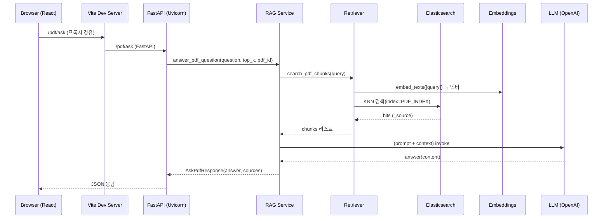
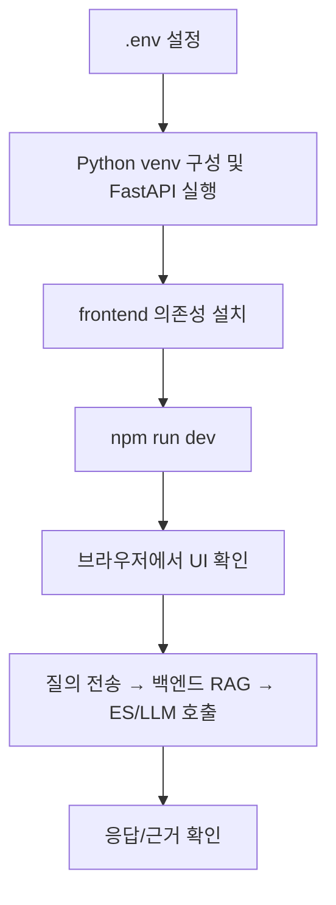

# FastAPIProject — 로컬 개발 워크플로우 가이드

아래 가이드는 Windows + Python 3.11 + Node.js(npm) 환경에서 프론트엔드(Vite + React + Tailwind)와 백엔드(FastAPI)를 동시에 구동하는 워크플로우를 정리합니다. 또한 RAG(사내 PDF 문서 검색/질의응답)를 위한 Elasticsearch 및 임베딩/LLM 의존성, 환경변수(.env)까지 포함합니다.

## 전체 아키텍처(개요)
```mermaid
flowchart LR
  subgraph Browser[Browser]
    UI[React App (Vite + Tailwind)]
  end

  subgraph Frontend[Frontend]
    ViteDev[Vite Dev Server (npm run dev)]
  end

  subgraph Backend[Backend]
    Uvicorn[Uvicorn (FastAPI)]
    RAG[RAG Service]
    RET[Retriever]
    ES[(Elasticsearch)]
    EMB[Embeddings]
    LLM[OpenAI Chat (langchain-openai)]
  end

  UI -->|HTTP (proxy: /pdf, /files)| ViteDev
  ViteDev -->|proxy| Uvicorn
  Uvicorn --> RAG --> RET --> ES
  RAG --> EMB
  RAG --> LLM
```

## 요청 흐름(상세)


## 디렉터리 구조(요약)
- app/ … FastAPI 백엔드
  - core/config.py … 환경변수 로딩 및 세팅
  - core/es.py … Elasticsearch 클라이언트 팩토리
  - pdf/ … RAG 관련 로직(retriever, rag_service, schemas 등)
  - llm/client.py … OpenAI LLM 클라이언트 (langchain-openai)
- frontend/ … React + Vite + Tailwind

## 사전 준비물
- Windows
- Python 3.11
- Node.js (최신 LTS 권장), npm
- Elasticsearch (개발용: 로컬 또는 Docker)

## .env 설정
루트에 `.env` 파일을 만들고 아래 예시를 참고해 값을 채워주세요.

```
# Elasticsearch
ES_URL=https://localhost:9200
ES_USER=elastic
ES_PASS=your_password
ES_VERIFY_CERTS=false

# 인덱스명 (PDF 조각 저장용)
PDF_INDEX=pdf_chunks_v1

# OpenAI
OPENAI_API_KEY=sk-...
OPENAI_EMBED_MODEL=text-embedding-3-small
OPENAI_EMBED_DIMS=1536

# LLM 모델 (필요 시 조정)
# app/core/config.py 기본값: gpt-4o-mini
# LLM_MODEL=gpt-4o-mini
```

참고: `.env`는 `app/core/config.py`에서 `python-dotenv`로 로드됩니다.

## 백엔드(FASTAPI) 실행
1) 가상환경 생성 및 패키지 설치

```
py -3.11 -m venv .venv
.venv\Scripts\activate
pip install -U pip
# 요구사항 파일이 있다면 사용: pip install -r requirements.txt
# 없을 경우 필요한 패키지 예시:
pip install fastapi uvicorn[standard] python-dotenv elasticsearch langchain-core langchain-openai
```

2) 서버 실행

```
uvicorn app.main:app --reload
```

## 프론트엔드 실행
1) 의존성 설치

```
cd frontend
npm install
```

2) 개발 서버 시작

```
npm run dev
```

Vite 개발 서버는 `vite.config.ts`의 proxy 설정에 따라 `/pdf`, `/files` 요청을 FastAPI(기본 http://localhost:8000)로 프록시합니다.

## Elasticsearch(개발) 준비
- ES 보안/인증 설정에 맞춰 `.env`의 `ES_URL`, `ES_USER`, `ES_PASS`, `ES_VERIFY_CERTS`를 조정하세요.
- `PDF_INDEX` 인덱스에는 최소한 아래 필드가 필요합니다.
  - `vector`: 쿼리 벡터와 동일한 차원(dims=OPENAI_EMBED_DIMS)의 dense_vector
  - `pdf_id`, `pdf_path`, `page_no`, `chunk_id`, `text`, `chunk_profile` 등 소스 필드
- 예시(개념): dense_vector 필드를 포함하는 매핑을 생성하고, chunk 도큐먼트를 색인해 두어야 `search_pdf_chunks`에서 KNN 검색이 가능합니다.

## RAG 구성 요소
- Embeddings: `app/core/embeddings.py`에서 `embed_texts`를 통해 OpenAI 임베딩 호출(구현 파일 기준). 모델/차원은 `.env`(OPENAI_EMBED_MODEL, OPENAI_EMBED_DIMS)로 제어.
- Retriever: `app/pdf/retriever.py` — 쿼리를 벡터화하고 Elasticsearch KNN 조회를 수행.
- RAG Service: `app/pdf/rag_service.py` — 컨텍스트를 구성하고 LLM 호출(langchain-openai)로 최종 답변 생성 및 근거(sources) 구성.

## 자주 발생하는 문제 및 해결
- Tailwind가 적용되지 않는 경우
  1) `frontend/tailwind.config.js`의 `content` 배열이 비어 있지 않은지 확인
     예시:
     ```js
     export default {
       content: [
         "./index.html",
         "./src/**/*.{js,ts,jsx,tsx,html}",
       ],
       theme: { extend: {} },
       plugins: [],
     }
     ```
  2) `src/index.css` 상단에 Tailwind 지시어 배치
     ```css
     @tailwind base;
     @tailwind components;
     @tailwind utilities;
     ```
  3) 변경 후 Vite dev 서버 재시작

- 동적 클래스 문자열로 인해 Tailwind 유틸이 빌드되지 않는 경우: `safelist`를 사용하거나 정적 문자열로 표현되도록 수정
- ES 연결 오류: URL/인증/SSL 검증 옵션 점검(`ES_VERIFY_CERTS=false`로 완화 가능)
- OpenAI 인증 오류: `OPENAI_API_KEY` 값과 네트워크 프록시/방화벽 확인

## 개발 워크플로우 요약


## 라이선스
사내 사용 목적으로 가정. 필요 시 라이선스 명시를 추가하세요.